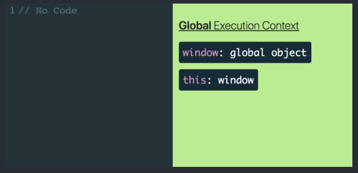
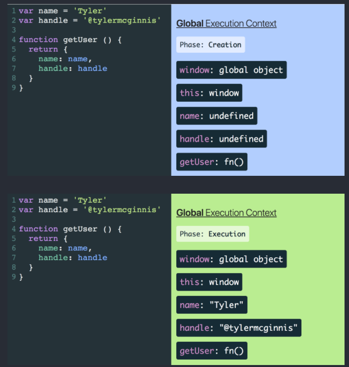

## [The Ultimate Guide to Hoisting, Scopes, and Closures in JavaScript](https://ui.dev/ultimate-guide-to-execution-contexts-hoisting-scopes-and-closures-in-javascript/)

> It may seem surprising, but in my opinion the most important and fundamental concept to understanding the JavaScript language is understanding Execution Context. By properly learning it, you’ll be positioned nicely to learn more advanced topics like hoisting, scope chains, and closures. With that in mind, what exactly is an “Execution Context”? To better understand it, let’s first take a look at how we write software.

Có vẻ bất ngờ nhưng với tôi thì nội dung cơ bản và quan trọng nhất để hiểu Js là hiểu được Execution Context. Việc nắm được nó bạn sẽ có được nền tảng thuận lợi để tiếp cận các vấn đề nâng cao hơn như hoisting, scop chains, và closures. Giữ điều đó trong đầu nhé, vậy thì "Execution Context" chính xác là gì? Để hiểu nó hơn, hãy nhìn vào cách chúng ta viết software.

> One strategy for writing software is to break our code up into separate pieces. Though these “pieces” have many different names (functions, modules, packages, etc), they all exist for a single purpose - to break apart and manage the complexity in our applications. Now instead of thinking like someone authoring code, think in terms of the JavaScript engine whose job is to interpret code. Can we use that same strategy, separating code into pieces, to manage the complexity of interpreting code just like we did in order to write it? Turns out we can and these “pieces” are called Execution Contexts. Just like functions/modules/packages allow you to manage the complexity of writing code, Execution Contexts allow the JavaScript engine to manage the complexity of interpreting and running your code. So now that we know the purpose of Execution Contexts, the next questions we need to answer are how do they get created and what do they consist of?

Một chiến lược để viết software là chia nhỏ code ra thành nhiều phần riêng lẻ. Các phần đó có thể có các có nhiều tên gọi khác nhau (functions, modules, packages, ...), tất cả chúng tồn tại vì một mục đích duy nhất - tách rời và quản lí sự phức tạp trong applications của chúng ta. Bây giờ thay vì suy nghĩ như một người viết code, hãy nghĩ về công việc của Js engine - thông dịch code. Chúng ta có xài được chiến lược cũ không? chia nhỏ code thành các phần, quản lí sự phức tạp của interpreting code như khi chúng ta viết nó? Chúng ta hoàn toàn có thể làm được và nó gọi là "Execution Context". Giống như functions/modules/packages cho phép bạn quản lí sự phức tạp của việc viết code, Execution Context chó phép Js engine quản lí sự phức tạp của interpreting và running code. Giờ chúng ta đã biết mục đích của Execution Context, câu hỏi kế tiếp mà chúng ta cần trả lời là chúng được tạo thế nào và chúng chứa những gì trong nó?

> The first Execution Context that gets created when the JavaScript engine runs your code is called the “Global Execution Context”. Initially this Execution Context will consist of two things - a global object and a variable called **this**. **this** will reference the global object which will be **window** if you’re running JavaScript in the browser or **global** if you’re running it in a Node environment.

Đầu tiền Execution Context sẽ được tạo khi Js engine run code được gọi là "Global Execution Context". Lúc đầu Execution Context sẽ chứa 2 thứ - một global object và một biến gọi là **this**. **this** sẽ reference đến một global object là **window** nếu bạn run Js trong browser hoặc **global** nếu bạn run code trong Node environment.



> Above we can see that even without any code, the Global Execution Context will still consist of two things - **window** and **this**. This is the Global Execution Context in its most basic form.

Qua hình trên ta có thể thấy mặc dù không có bất kì dòng code nào thì Global Execution Context vẫn chứa 2 thứ - **window** và **this**. Đây là Global Execution Context ở trạng thái cơ bản nhất của nó.

> Let’s step things up and see what happens when we start actually adding code to our program. Let’s start with adding a few variables.

Hãy thêm vào dòng code để xem chuyện gì sẽ xảy ra nào, bắt đầu với việc thêm vài biến.



> Can you spot the differences between those two image above? The key take away is that each Execution Context has two separate phases, a Creation phase and an Execution phase and each phase has its own unique responsibilities.

Bạn có nhận ra điểm khác biệt giữa 2 hình trên chưa? Điểm mấu chốt ở đây là mỗi Execution Context sẽ có 2 phase, một phase Creation và một Execution phase, mỗi phase chịu trách nhiệm riêng biệt.

> In the Global Creation phase, the JavaScript engine will
> 1. Create a global object.
> 2. Create an object called “this”.
> 3. Set up memory space for variables and functions.
> 4. Assign variable declarations a default value of “undefined” while placing any function declarations in memory.

Trong Global Creation phase thì Js engine sẽ thực hiện:
1. Tạo một global object
2. Tạo một object gọi là ***this***
3. Set up memory cho mỗi biến và function.
4. Assign vào mỗi biến đã mô tả một giá trị default là ***undefined***, đặt function được khai báo vào memory

> It’s not until the Execution phase where the JavaScript engine starts running your code line by line and executing it.

Phải đến Execution phase thì Js engine mới bắt đầu run những dòng code của bạn và thực thi nó

> We can see this flow from Creation phase to Execution phase in the GIF below.

Hãy xem flow từ Creation phase -> Execution phase qua gif dưới đây


[Visualize the code yourself](https://ui.dev/javascript-visualizer/?code=var%20name%20%3D%20%27Tyler%27%0Avar%20handle%20%3D%20%27%40tylermcginnis%27%0A%0Afunction%20getUser%20%28%29%20%7B%0A%20%20return%20%7B%0A%20%20%20%20name%3A%20name%2C%0A%20%20%20%20handle%3A%20handle%0A%20%20%7D%0A%7D)

> During the **Creation** phase, **window** and **this** are created, variable declarations (**name** and **handle**) are assigned a default value of **undefined**, and any function declarations (**getUser**) are placed entirely into memory. Then once we enter the **Execution** phase, the JavaScript engine starts executing the code line by line and assigns the real values to the variables already living in memory.<br>

Trong suốt **Creation** phase, **window** và **this** được tạo, các biến được mô tả(**name** và **handle**) được assign default value là **undefined**, và bất kì function được mô tả(**getUser**) sẽ được đặt vào trong memory. Sau đó chúng ta sẽ vào **Execution** phase, Js engine sẽ bắt đầu thực thi từng dòng code và assign giá trị thực sự vào các biến đã thực sự tồn tại trong memory.

> To really cement this idea of Creation phase vs Execution phase, let’s log some values after the Creation phase and before the Execution phase.

Để củng cố chắc chắn idea về **Creation** phase và **Execution** phase, hãy log vài value sau **Creation** phase và trước **Execution** phase.

```
console.log('name: ', name)
console.log('handle: ', handle)
console.log('getUser :', getUser)

var name = 'Tyler'
var handle = '@tylermcginnis'

function getUser () {
  return {
    name: name,
    handle: handle
  }
}
```

> In the code above, what do you expect to be logged to the console? By the time the JavaScript engine starts executing our code line by line and invoking our console.logs, the **Creation** phase has already happened. What that means is that, as we saw earlier, the variable declarations should have been assigned a value of **undefined** while the function declaration should be fully in memory already. So just as we should expect, **name** and **handle** are **undefined** and **getUser** is a reference to the function in memory.

Trong đoạn code trên, bạn mong đợi điều gì sẽ được log ra từ console? Khi mà Js engine bắt đầu thực thi từng dòng code và gọi console.log, thì **Creation** phase đã thực sự xảy ra rồi. Điều đó có nghĩa là gì, như chúng ta đã ngâm cứu trước đó, các biến đã khai báo đã được gán một giá trị **undefined**, trong khi các function nên sẵn sàng trong memory rồi. Vậy nên chúng ta sẽ mong đợi **name** và **handle** là **undefined**, **getUser** là reference đến function trong memory.

```
console.log('name: ', name) // name: undefined
console.log('handle: ', handle) // handle: undefined
console.log('getUser :', getUser) // getUser: ƒ getUser () {}

var name = 'Tyler'
var handle = '@tylermcginnis'

function getUser () {
  return {
    name: name,
    handle: handle
  }
}
```

> This process of assigning variable declarations a default value of **undefined** during the creation phase is called Hoisting.

Quá trình assign một giá trị mặc định **undefined** vào các biến đã khai báo trong creation phase được gọi là **Hoisting**.

> Hopefully you just had an ‘Aha!” moment. You may have had “hoisting” explained to you previously without much success. The thing that’s confusing about “hoisting” is that nothing is actually “hoisted” or moved around. Now that you understand Execution Contexts and that variable declarations are assigned a default value of undefined during the Creation phase, you understanding “hoisting” because that’s literally all it is.

Hi vọng bạn vừa có một khoảng khắc "Aha!". Có thể trước đây bạn đã được giải thích về "hoisting" mà không thật sự hiểu. Điều khiến chúng ta bối rối về "hoisting" đó là không có gì thực sự "hoisted" hay di chuyển xung quanh. Bây giờ bạn đã hiểu về Execution Context và các biến khai báo sẽ được assigned một default value trong suốt Creation phase, bạn cũng hiểu về "hoisting" vì đó là tất cả những gì xảy ra theo nghĩa đen.

---

> At this point you should be fairly comfortable with the Global Execution Context and its two phases, **Creation** and **Execution**. The good news is there’s only one other Execution Context you need to learn and its almost exactly identical to the Global Execution Context. It’s called the Function Execution Context and it’s created whenever a function is **invoked**.

Tới lúc này thì bạn đã thoải mái với Global Execution Context và 2 phase của nó, **Creation** và **Execution**. Tin tốt là giờ chỉ còn một Execution Context mà bạn cần hiểu và nó thì gần như giống hệt với Global Execution Context. Nó được gọi là Function Execution Context và nó được tạo ngay khi một function được gọi.

> Now the main question we need to answer is what’s the difference between the Global Execution Context and a Function Execution Context. If you remember from earlier, we said that in the Global Creation phase, the JavaScript engine will
> 1. Create a global object.
> 2. Create an object called “this”.
> 3. Set up memory space for variables and functions.
> 4. Assign variable declarations a default value of “undefined” while placing any function declarations in memory.

Giờ câu hỏi quan trọng mà chúng ta cần trả lời là điểm khác biệt giữa Global Execution Context và Function Execution Context. Nếu bạn nhớ thì khúc trên chúng tôi đã nói trong Global Creation phase, Js engine sẽ:
1. Tạo một global object
2. Tạo một object gọi là ***this***
3. Set up memory cho mỗi biến và function.
4. Assign vào mỗi biến đã mô tả một giá trị default là ***undefined***, đặt function được khai báo vào memory

> Which of those steps **doesn’t** make sense when we’re talking about a Function Execution Context? It’s step #1. We should only ever have one global object that’s created during the **Creation** phase of the Global Execution Context, not every time a function is invoked and the JavaScript engine creates a Function Execution Context. Instead of creating a global object, one thing a Function Execution Context needs to worry about that the Global Execution Context doesn’t are arguments. With that in mind, we can adapt our list from earlier. Whenever a **Function** Execution Context is created, the JavaScript engine will<br>
> ~~1. Create a global object.~~
> 1. Create an arguments object.
> 2. Create an object called this.
> 3. Set up memory space for variables and functions.
> 4. Assign variable declarations a default value of “undefined” while placing any function declarations in memory.

Trong những bước trên thì bước nào không có ý nghĩa khi chúng ta nói về Function Execution Context. Nó là #1. Chúng ta chỉ có một global object mà đã được tạo ở Creation phase của Global Execution Context, không phải lần nào function được gọi thì Js engine tạo một Function Execution Context. Thay vì tạo một global object, thứ mà Function Execution Context cần lo lắng là Global Execution Context không có arguments. Tiếp tục với suy nghĩ đó, chúng ta sẽ điều chỉnh list trước đó. Bất kì lúc nào một **Function** Execution Context được tạo, Js engine sẽ:<br>
~~1. Tạo một global object~~
1. Tạo một arguments object.
2. Tạo một object gọi là ***this***
3. Set up memory cho mỗi biến và function.
4. Assign vào mỗi biến đã mô tả một giá trị default là ***undefined***, đặt function được khai báo vào memory

> To see this in action, let’s go back to the code we had earlier, but this time instead of just defining getUser, let’s see what happens when we invoke it.

Để xem xét cụ thể action này, trở lại với đoạn code mà chúng ta có lúc trước, nhưng lần này thay vì chỉ định nghĩa **getUser** thì chúng ta sẽ gọi nó để xem chuyện gì sẽ xảy ra.


[Visualize the code yourself](https://ui.dev/javascript-visualizer/?code=var%20name%20%3D%20%27Tyler%27%0Avar%20handle%20%3D%20%27%40tylermcginnis%27%0A%0Afunction%20getUser%20%28%29%20%7B%0A%20%20return%20%7B%0A%20%20%20%20name%3A%20name%2C%0A%20%20%20%20handle%3A%20handle%0A%20%20%7D%0A%7D%0A%0AgetUser%28%29)

> Just as we talked about, when we invoke getUser a new Execution Context is created. During the Creation phase of getUsers Execution Context, the JavaScript engine creates a this object as well as an arguments object. Because getUser doesn’t have any variables, the JavaScript engine doesn’t need to set up any memory space or “hoist” any variable declarations.

Như chúng ta đã nói, khi gọi **getUser** thì một Execution Context mới sẽ được tạo. Suốt **Creation** phase của **getUser** Execution Context, Js engine sẽ tạo một object **this** như một arguments object. Vì **getUser** không có bất kì biến nào, Js engine không cần phải set up memory hay "hoist" bất kì các biến đã được khai báo.

> You may have also noticed that when the **getUser** function is finished executing, it’s removed from the visualization. In reality, the JavaScript engine creates what’s called an “Execution Stack” (also known as the “Call Stack”). Anytime a function is invoked, a new Execution Context is created and added to the Execution Stack. Whenever a function is finished running through both the Creation and Execution phase, it gets popped off the Execution Stack. Because JavaScript is single threaded (meaning only one task can be executed at a time), this is easy to visualize. With “JavaScript Visualizer” the Execution Stack is shown in a nested fashion with each nested item being a new Execution Context on the Execution Stack.

Bạn có thể chú ý khi **getUser** được thực thi xong, nó bị remove khỏi visualization. Trong thực tế, Js engine sẽ tạo một cái gọi là "Execution Stack" (cũng được biết với cái tên "Call Stack"). Bất kì lúc nào function được gọi, một Execution Context mới sẽ được tạo và được add vào Execution Stack. Một khi function đã chạy qua cả Creation và Execution phase và kết thúc, nó sẽ được remove khỏi Execution Stack. Bởi vì Js là single threaded (nghĩa là tại một thời điểm chỉ duy nhất một task được thực thi), điều này thực sự rất dễ hình dung.


[Visualize the code yourself](https://ui.dev/javascript-visualizer/?code=function%20a%20%28%29%20%7B%0A%20%20console.log%28%27In%20fn%20a%27%29%0A%20%20%0A%20%20function%20b%20%28%29%20%7B%0A%20%20%20%20console.log%28%27In%20fn%20b%27%29%0A%20%20%20%20%0A%20%20%20%20function%20c%20%28%29%20%7B%0A%20%20%20%20%20%20console.log%28%27In%20fn%20c%27%29%0A%20%20%20%20%7D%0A%20%20%20%20%0A%20%20%20%20c%28%29%0A%20%20%7D%0A%0A%20%20b%28%29%0A%7D%0A%0Aa%28%29)

---

At this point we’ve seen how function invocations create their own Execution Context which get placed on the Execution Stack. What we haven’t seen yet is how local variables play into that. Let’s change up our code so our functions have local variables.

Đến lúc này chúng ta thấy cách function được gọi tạo Execution Context của chính nó và đặt vào trong Execution Stack. Chúng ta vẫn chưa thấy cách mà một biến local hoạt động bên trong. Hãy thay đổi một chút để function có thêm các biến local.


[Visualize the code yourself](https://ui.dev/javascript-visualizer/?code=var%20name%20%3D%20%27Tyler%27%0Avar%20handle%20%3D%20%27%40tylermcginnis%27%0A%0Afunction%20getURL%20%28handle%29%20%7B%0A%20%20var%20twitterURL%20%3D%20%27https%3A%2F%2Ftwitter.com%2F%27%0A%0A%20%20return%20twitterURL%20%2B%20handle%0A%7D%0A%0AgetURL%28handle%29)

> There are few important details to notice here. First is that any argument you pass in will be added as a local variable in that function’s Execution Context. In the example **handle** exists both as a variable in the Global Execution Context (since that’s where it was defined) as well as the **getURL** Execution Context because we passed it in as an argument. Next is that variables declared inside of a function live inside that function’s Execution Context. So when we created **twitterURL**, it lived inside of the **getURL** Execution Context since that’s where it was defined, not the Global Execution Context. That may seem obvious, but it’s fundamental to our next topic, Scopes.

Có vài chi tiết quan trọng cần chú ý ở đây. Đầu tiên là bất kì argument nào bạn đưa vào thì sẽ được add vào như một biến local trong Execution Context của function. Trong ví dụ trên thì **handle** tồn tại như một variable ở cả Global Execution Context(ở chỗ mà nó được định nghĩa) và ở trong **getURL** Execution Context khi chúng ta đưa nó vào như một tham số truyền vào function. Kế tiếp là biến được mô tả bên trong function tồn tại trong function Execution Context. Vậy nên khi chúng ta tạo **twitterURL**, nó tồn tại trong **getURL** Execution Context, không tồn tại trong Global Execution Context. Điều đó có vẻ là một điều thiên kinh địa nghĩa, nhưng nó là nền tảng cho topic tiếp theo của chúng ta, Scopes.

---

> In the past you probably heard a definition of “Scope” along the lines of “where variables are accessible”. Regardless of whether or not that made sense at the time, with your newfound knowledge of Execution Contexts and the JavaScript Visualizer tool, Scopes will be more clear than they’ve ever been. In fact, MDN defines “Scope” as “The current context of execution.” Sound familiar? We can think of “Scope” or “where variables are accessible” in a very similar way to how we’ve been thinking about execution contexts.

Có lẽ bạn đã từng nghe về định nghĩa của "Scope" như "nơi mà biến có thể truy cập được". Bất kể nó hợp lí lúc đó hay không thì lúc này với những kiến thức về Execution Context và JavaScript Visualizer tool, Scopes sẽ rõ ràng với bạn hơn bao giờ hết. Sự thật là tỏng MDN đã định nghĩa Scope là "current context of execution". Nghe rất quen thuộc phải không?

> Here’s a test for you. What will bar be when it’s logged in the code below?

Đây là một thách đố nhỏ cho bạn. **bar** sẽ thế nào khi nó được log ra trong đoạn code dưới đây.

```
function foo () {
  var bar = 'Declared in foo'
}

foo()

console.log(bar)
```

> Let’s check it out in JavaScript Visualizer.

Hãy cùng kiểm tra nó trong JavaScript Visualizer


[Visualize the code yourself](https://ui.dev/javascript-visualizer/?code=function%20foo%20%28%29%20%7B%0A%20%20var%20bar%20%3D%20%27Declared%20in%20foo%27%0A%7D%0A%0Afoo%28%29%0A%0Aconsole.log%28bar%29)

> When foo is invoked we create a new Execution Context on the Execution Stack. The Creation phase creates this, arguments, and sets bar to undefined. Then the Execution phase happens and assigns the string Declared in foo to bar. After that the Execution phase ends and the foo Execution Context is popped off the stack. Once foo is removed from the Execution Stack, we try to log bar to the console. At that moment, according to JavaScript Visualizer, it’s as if bar never even existed so we get ReferenceError: bar is not defined. What this shows us is that variables created inside of a function are locally scoped. That means (for the most part, we’ll see an exception later) they can’t be accessed once the function’s Execution Context has been popped off the Execution Stack.

Khi foo được gọi, chúng tạo một new Execution Context trên Execution Stack. Creation phase tạo this, arguments, và set bar là undefined. Khi Execution phase xảy ra và gán chuỗi **Declared in foo** vào trong **bar**. Sau Execution phase kết thúc thì foo Execution Context sẽ bị đưa ra khỏi stack. Một khi foo bị remove khỏi Execution Stack, chúng ta thử log giá trị của **bar** ra console. Vào thời điểm này, theo như JavaScript Visualizer, thì **bar** chưa bao giờ tồn tại, vậy nên chúng ta sẽ bị lỗi ReferenceError: **bar** chưa được định nghĩa. Điều này cho chúng ta thấy rằng những biến được tạo trong function thuộc về local scope. Nghĩa là chúng không thể được truy cập một khi function Execution Context bị đưa ra khỏi Execution Context.