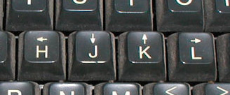

## [Here is why vim uses hjkl keys as arrow keys](https://catonmat.net/why-vim-uses-hjkl-as-arrow-keys)

> I was reading about vim the other day and found out why it used hjkl keys as arrow keys. 
> When Bill Joy created the vi text editor he used the ADM-3A terminal, which had the arrows on hjkl keys. Naturally he reused the same keys and the rest is history. 
> Here is how the hjkl keys looked. 

Dạo gần đây tôi tìm hiểu về Vim và phát hiện tại sao nó lại sử dụng các phím hjkl như arrows key. 
Khi Bill Joy tạo vi thì ông ấy đã sử dụng ADM-3A terminal, các phím arrow trên máy này cũng là hjkl. Một lẽ tự nhiên, Bill đã sử dụng lại các phím đấy. 
Dưới đây là hình ảnh các phím hjkl trên chiếc máy đó

> And here is how the the whole terminal that vi was created on looks like.

Và đây là chiếc máy mà đã được sử dụng để tạo vi editor

> Since vim is derived from vi, it uses the same hjkl keys.

Và vì vim cũng có nguồn gốc từ vi, nó cũng sử dụng cùng các phím hjkl làm arrow key

> And while we're at it, notice where the ESC key is positioned. ESC is where TAB is on modern keyboards.

Hãy chú ý tới vị trí của phím ESC, ESC ở vị trí tab so với các bàn phím hiện đại bây giờ

> That's why the ESC was used to change between vi modes – it was so close and easy to reach.

Đó là lí do tại sao ESC được sử dụng để thay đổi vi mode - nó gần và dễ dàng với tới

